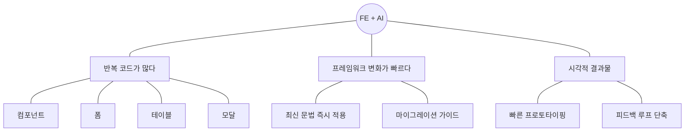

# 왜 지금인가

---

## AI 코딩 도구 ≠ 자동완성

AI는 단순히 코드 다음 줄을 채워주는 도구가 아니다.
**설계 → 구현 → 검증**, 개발 전 과정에서 함께 일하는 협업 파트너다.

---

## FE에서 특히 중요한 이유

FE 개발은 유사한 패턴이 반복되고, 프레임워크 변화에 민감하며, 빠른 시각적 피드백이 중요하다.
이 세 가지 특성이 AI 활용과 특히 잘 맞는다.

