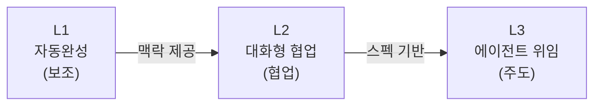
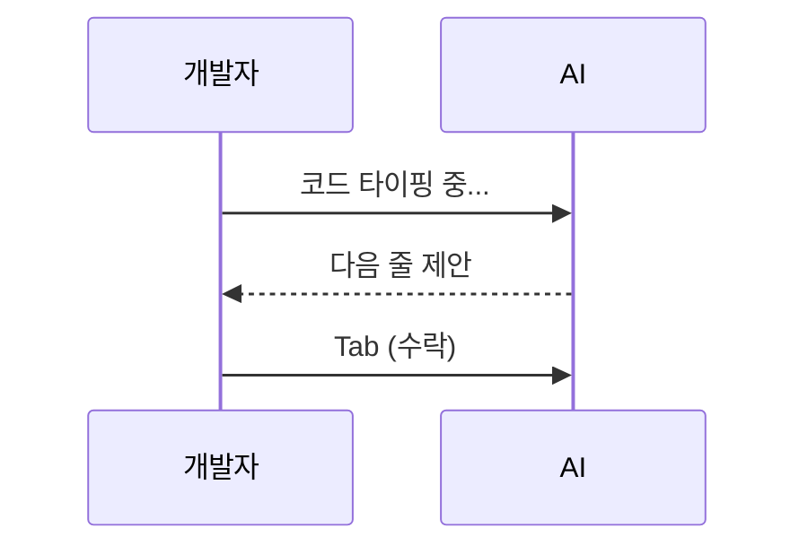
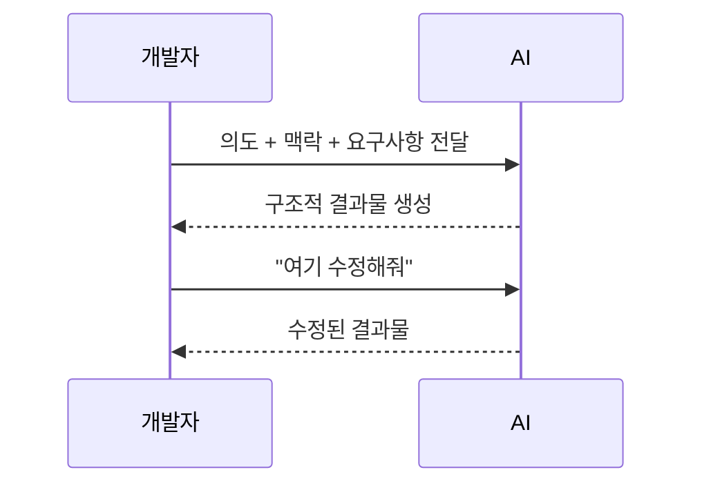
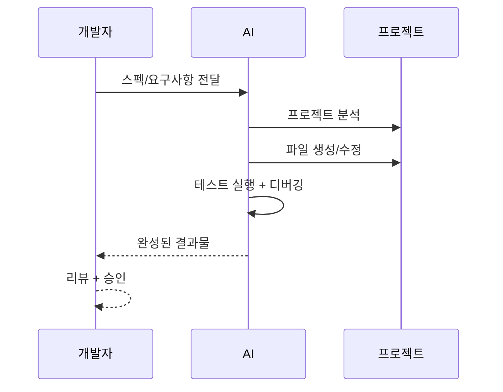

# AI 도입 3단계 성숙도 모델

---

## 전체 그림

AI 도입에는 단계가 있다. 대부분의 팀은 L1에 머물러 있지만, 실질적 효과는 L2부터 나타난다.

---

## L1: 자동완성

코드를 타이핑하면 AI가 다음 줄을 제안하고, 개발자가 Tab으로 수락하는 방식.
현재 파일 수준의 맥락만 이해하며, 프로젝트 전체 구조나 컨벤션은 모른다.

- **도구**: Copilot, Tabnine, Codeium
- **맥락**: 현재 파일/열린 탭 수준
- **한계**: 프로젝트 컨벤션, 아키텍처를 모름

---

## L2: 대화형 협업

개발자가 의도와 맥락을 설명하면, AI가 여러 파일에 걸친 구조적 결과물을 생성한다.
개발자는 **무엇을(What)** 정의하고, AI는 **어떻게(How)** 구현한다.

- **도구**: Cursor Chat, Copilot Chat, Claude
- **핵심**: 개발자 = **What**, AI = **How**

---

## L3: 에이전트 위임

스펙을 주면 AI가 프로젝트를 직접 분석하고, 파일을 생성/수정하며, 테스트까지 실행한다.
사람은 최종 결과물을 리뷰하고 승인하는 역할을 맡는다.

- **도구**: Claude Code, Cursor Agent
- **핵심**: 사람 = **최종 리뷰어**

---

## 핵심

> **L1 → L2 전환이 가장 투자 대비 효과가 크다**
>
> L1은 타이핑을 줄여주지만, L2는 **사고의 단위**를 바꿔준다
