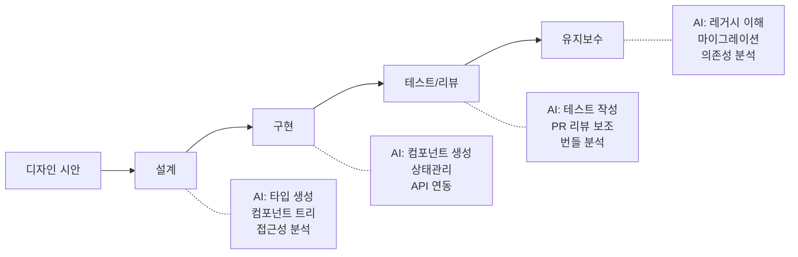
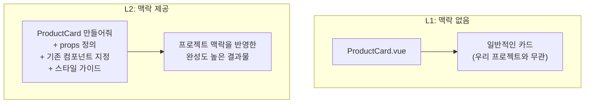
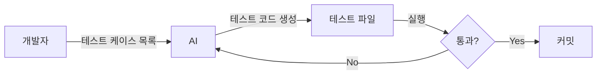
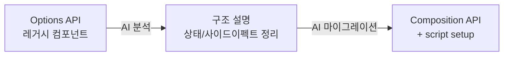
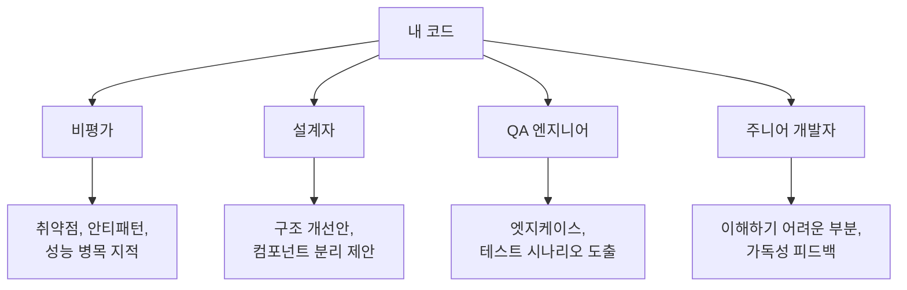

# FE 워크플로우별 AI 활용 포인트

---

## 어디에 AI를 쓸 수 있는가

FE 개발의 설계부터 유지보수까지, 각 단계마다 AI가 도울 수 있는 영역이 있다.

---

## 설계 단계

디자인 시안이나 API 응답을 AI에게 주면, 타입 정의와 컴포넌트 구조를 빠르게 도출할 수 있다.

| 작업 | AI 활용 |
|------|---------|
| API 응답 → TypeScript 타입 | JSON 주고 타입/인터페이스 생성 |
| 디자인 → 컴포넌트 트리 | 구조 설명 → 계층 + props 도출 |
| 접근성 요구사항 | 컴포넌트별 ARIA/키보드 정리 |

---

## 구현 단계 — L1 vs L2 차이

L1은 맥락 없이 일반적인 코드를 제안하지만, L2는 프로젝트의 기존 컴포넌트, 스타일, 패턴을 반영한 결과물을 생성한다.

---

## 구현 단계 — 활용 예시

구체적인 라이브러리와 패턴을 프롬프트에 명시하면, 프로젝트 컨벤션에 맞는 코드가 나온다.

| 작업 | 프롬프트 핵심 |
|------|---------------|
| 상태관리 | "Pinia 스토어 — addItem, removeItem, totalPrice getter" |
| 폼 | "VeeValidate + zod, 필드별 에러 메시지" |
| 반응형 | "모바일 1열, 태블릿 2열, 데스크탑 3열 그리드" |
| API 연동 | "composable useFetch, 에러 toast, 로딩 skeleton" |

---

## 테스트/리뷰 단계

테스트 케이스 목록은 개발자가 정하고, 테스트 코드 구현은 AI에게 맡긴다.
실패하면 AI가 수정하고 다시 실행하는 루프를 반복한다.

| 작업 | AI 활용 |
|------|---------|
| 유닛 테스트 | 테스트 케이스 목록 → 구현은 AI |
| PR 리뷰 보조 | 불필요한 reactivity, 메모리 누수, 접근성 관점 |
| 번들 분석 | 변경사항의 번들 사이즈 영향 |

---

## 유지보수 단계

레거시 코드를 AI에게 분석시키면 구조를 빠르게 파악할 수 있고, Options API에서 Composition API로의 마이그레이션도 자동화할 수 있다.

| 작업 | AI 활용 |
|------|---------|
| 레거시 이해 | "이 컴포넌트가 뭘 하는지 설명해줘" |
| 마이그레이션 | "Options API → Composition API, 동작 동일하게" |
| 의존성 업데이트 | "Vue Router v3→v4 우리 코드 영향" |

---

## AI에게 역할(페르소나)을 부여하라

같은 코드라도 **AI에게 어떤 관점을 요청하느냐**에 따라 완전히 다른 피드백을 받을 수 있다.
한 명의 AI에게 여러 전문가의 시선으로 코드를 검토받는 것과 같다.

---

## 페르소나 활용 예시

| 페르소나 | 프롬프트 예시 | 얻을 수 있는 것 |
|----------|-------------|----------------|
| 시니어 코드 리뷰어 | "10년차 Vue 시니어로서 이 코드를 리뷰해줘" | 패턴 일관성, 유지보수성 피드백 |
| 보안 전문가 | "보안 관점에서 이 컴포넌트를 점검해줘" | XSS, 인젝션, 인증 취약점 |
| 접근성 전문가 | "WCAG 2.1 AA 기준으로 이 폼을 검토해줘" | aria 속성 누락, 키보드 네비게이션 |
| 성능 엔지니어 | "이 컴포넌트의 렌더링 성능을 분석해줘" | 불필요한 reactivity, computed 최적화 |
| 악의적 사용자 | "이 입력 폼을 깨뜨릴 수 있는 모든 방법을 알려줘" | 엣지케이스, 검증 우회 시나리오 |
| 신입 개발자 | "이 코드를 처음 보는 사람으로서 이해 안 되는 부분은?" | 가독성, 네이밍, 주석 필요 지점 |

---

## 핵심

> **같은 AI라도 맥락의 품질에 따라 결과가 하늘과 땅 차이**
>
> "컴포넌트 만들어줘" vs "이런 props, 이런 스타일, 이런 패턴으로 만들어줘"
