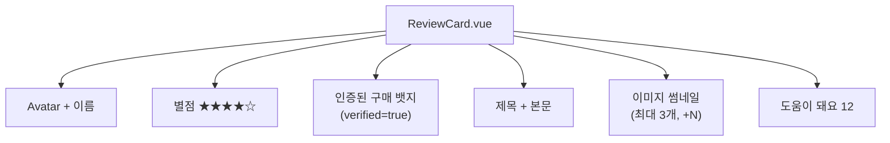

# 라이브 데모

> 상품 리뷰 카드 컴포넌트를 AI와 함께 실시간으로 만들어본다

---

## Step 1. 타입 정의

아래 API 응답 JSON을 AI에게 주고, TypeScript 타입을 생성하도록 요청한다.

```json
{
  "id": "rv_001",
  "author": { "name": "김철수", "avatarUrl": "...", "reviewCount": 42 },
  "rating": 4,
  "title": "가성비 좋은 제품",
  "content": "배송도 빠르고 품질도 기대 이상입니다...",
  "images": ["https://..."],
  "helpful": 12,
  "createdAt": "2026-04-01T09:00:00Z",
  "verified": true
}
```

---

## Step 2. 컴포넌트 구현

생성된 타입을 기반으로, 아래 구조의 ReviewCard.vue 컴포넌트를 AI에게 만들도록 요청한다.



추가 요구사항: tailwindcss, 반응형, 접근성(aria-label, alt, 키보드)

---

## Step 3. 테스트 작성

테스트 케이스 목록을 정하고, AI에게 Vitest + Vue Test Utils로 테스트 코드를 생성시킨다.

| # | 테스트 케이스 |
|---|--------------|
| 1 | 리뷰 내용(제목, 본문, 작성자)이 렌더링되는지 |
| 2 | 별점이 rating 값에 맞게 표시되는지 |
| 3 | verified=true일 때 인증 뱃지가 보이는지 |
| 4 | 이미지가 4개 이상일 때 "+N" 표시가 나오는지 |
| 5 | "도움이 돼요" 버튼 클릭 시 이벤트가 발생하는지 |

---

## Step 4. 실행

생성된 테스트를 실행하여 결과를 확인한다.

```bash
npm run test
```

---

## 보너스

> 지금 이 컴포넌트에 기능을 하나 추가한다면?

청중이 직접 요구사항을 던지고, 실시간으로 AI에게 전달하여 구현하는 과정을 시연한다.
