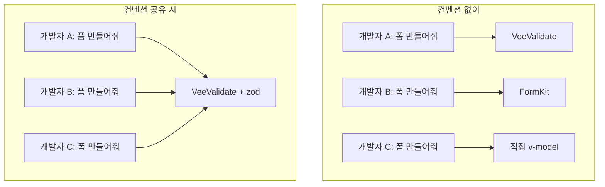

# 도입 시 흔한 실패 패턴

AI를 도입한 팀에서 자주 듣는 불만 5가지와, 왜 그런 일이 생기는지, 어떻게 해결하는지를 정리했다.

---

## 1. "AI가 만든 코드가 우리 프로젝트랑 안 맞아요"

AI는 우리 프로젝트의 컨벤션을 모른다. "폼 만들어줘"라고만 하면 AI가 알아서 아무 라이브러리를 골라 쓴다.
**프롬프트에 사용할 라이브러리, 기존 컴포넌트, 스타일을 명시**하면 결과가 달라진다.

```
"로그인 폼 만들어줘"                    ← 이렇게 하면 안 됨

"VeeValidate + zod 사용,               ← 이렇게 해야 함
 이메일/비밀번호 필드,
 기존 BaseButton/BaseInput 컴포넌트 사용,
 tailwindcss, 모바일 퍼스트"
```

---

## 2. "결국 사람이 다 고쳐야 해요"

AI의 결과물에 100% 완성을 기대하면 실망할 수밖에 없다.
AI는 **초안을 빠르게 만드는 도구**이고, 사람은 **판단하고 다듬는 역할**이다.

> 80%를 30초에 받고 20%를 10분에 다듬기 vs 처음부터 100%를 40분에 만들기

핵심은 "다 고쳐야 한다"가 아니라, **수정할 부분만 집중하면 된다**는 관점 전환이다.

---

## 3. "같은 걸 시켜도 사람마다 결과가 달라요"

팀에 공유된 기준이 없으면 같은 요청에도 각자 다른 결과가 나온다.
**프로젝트 컨벤션 파일을 만들어 AI 도구에 연결**하면, 누가 써도 같은 패턴의 코드가 나온다.



---

## 4. "회사 코드가 AI 학습에 쓰이는 거 아닌가요?"

유료/엔터프라이즈 플랜은 코드를 AI 학습에 사용하지 않는다고 명시하고 있다.
무료 플랜은 학습에 활용될 수 있으므로, 업무용으로는 반드시 유료 플랜을 사용해야 한다.

| 도구 | 코드 학습에 사용하는가 |
|------|:-:|
| Copilot Business/Enterprise | 사용 안 함 |
| Claude Team/Enterprise | 사용 안 함 |
| Cursor Pro | 사용 안 함 |
| ChatGPT 무료 | **사용할 수 있음** |

인증, 결제 등 민감한 코드는 AI에 넘기지 않는 **팀 가이드라인**도 함께 수립한다.

---

## 5. "한번 써봤는데 별로였어요"

대부분 1-2번 써보고 기대한 만큼 안 되면 포기한다.
하지만 AI 도구는 **최소 2주간 매일 써야** 본인만의 활용 패턴이 만들어진다.

- **처음에는 작은 것부터**: 타입 생성, 코드 설명, 테스트 작성
- **점점 범위를 넓혀서**: 컴포넌트 생성, 리팩토링, PR 리뷰
- **팀 내 주간 공유**: "이번 주에 AI로 이런 걸 해봤다" → 서로의 활용법을 배움
